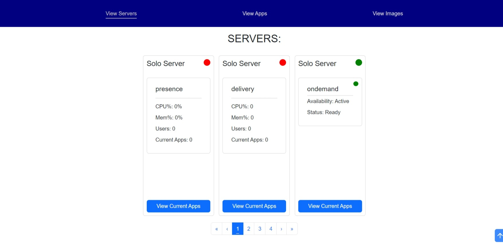
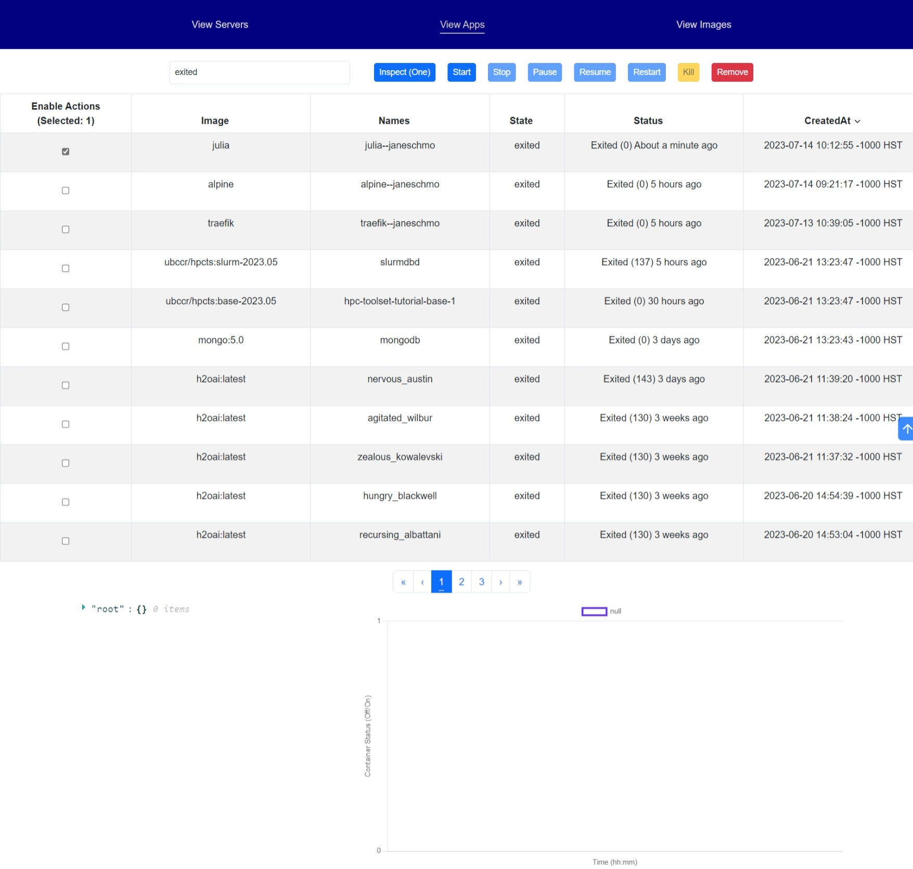
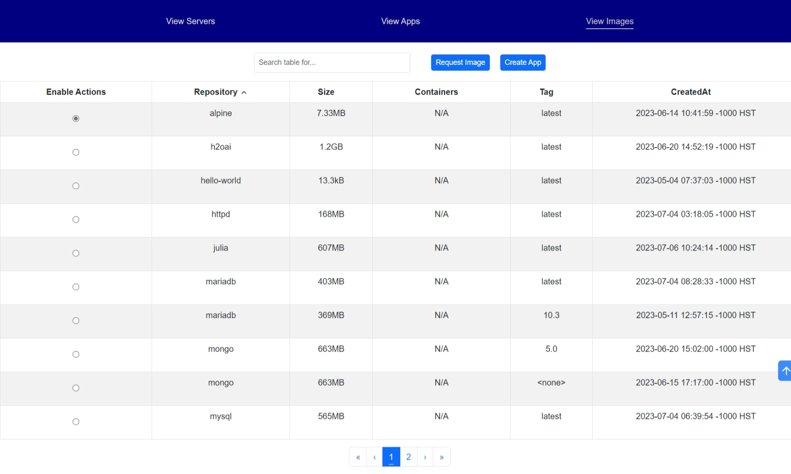

# Docker Dash

### Table of Contents
1. [Introduction](#introduction)
1. [Getting Started](#getting-started)
1. [Docker Dash API](#docker-dash-api)

---

<br>

# Introduction

Docker Dash is a handy web GUI dashboard made for administrators to manage apps running as docker containers on a server. This project was created to demonstrate the concept of containerization in the context of user/app management on a multiple servers.

Docker Dash is designed to be running on a individual/multiple servers. A user wishing to access the server will do so through various apps, which are then spawned on the server as Docker containers, and managed easily by an administrator through Docker Dash. 

## Security warning

This project was created as a mockup to demonstrate the concept of containerization, rather than a full-fledged, officially maintained product. With that in mind, safety and security were not the highest concern during development. Be advised that significant security vulnerabilities may exist in many aspects of this project.

<br>

# Getting Started

## General Usage

### View Servers
This page displays the servers active on the network as well as some of their important metrics. Included is CPU%, memory%, amount of unique users, and number of applications running on that unit.
This page displays the servers active on the network as well as some of their important metrics. 

Included is CPU%, memory%, amount of unique users, and number of applications running on that unit.

The colored circle on the top right of the server cards flashes green to indicate the system is running smoothly and red otherwise.



---

### View Applications
This page allows the user to see the complete list of applications running on the network and allows them to perform tasks on these applications.

#### Functionality 
- Start: starts selected application
- Pause: Pauses the specified app. The app must be running in order to pause
- Unpause: Unpauses the specified app. The app must be paused in order to unpause
- Restart: Restarts the specified app.
- Remove: Removes an application from the network
- Kill: Forcefully stops the specified app.
  


---

### View Images
This page allows the user to see what iso images that apps can be created from, update this list, and use the image to create apps.
#### Functionality
- Request Image: Sends a request to add an image from Dockerhub, which then adds the iso image to the images page
- Create App: Generates an application instance from the selected image, that can be found in the apps page.



---

<br>

## Hosting the website

### Prerequisites:
- Integrated Development Environment on your computer
- Internet connection
- Admin privileges

### Setup guide:
- Open terminal
- Navigate to client folder: `cd client`
- In Terminal run: `npm install` and `npm run dev` to start your development server.


<br>
<br>

# Docker Dash API

Detailed documentation of the Docker Dash API and its methods can be found at `server/README.md` or at [this link](https://github.com/JaxsonP/docker-dash/tree/master/server#readme).

## Overview

This API serves as a backend for Docker Dash, providing an interface between the docker and the dashboard. Functionality includes creating, running, and killing apps, as well as getting an app's status, resource usage, and uptime logs. This API also includes support for Docker's swarm mode, however due to the nature of swarm mode, it's functionality varies significantly from Docker without swarm mode, which will be referred to as solo mode. All files relevant to the API are located in the `server/` folder.

## Setup Guide

### Prerequisites:
- CentOS 7 | Ubuntu | RHEL(broken) 
- Internet connection
- All nodes must have unique hostnames *(for swarm mode)*

*Notes: Installation should ideally work on other Red-Hat-based distros, but it hasn't been formally tested.*

### For Solo Mode:

Run this command (you may be asked for sudo password):
``` bash
bash <(curl -s https://raw.githubusercontent.com/JaxsonP/docker-dash/master/server/scripts/solo_install.sh)
```
This will download all files and install and configure Docker and Python 3.9.16. This can take up to 5-10 minutes. You will be prompted to restart, then run the `start-server` script to start the API. If you are in the `docker-dash` folder the command will be:
``` bash
./start-server
```
This will start the API as a service, which will then be running in the background indefinitely on the system. If you need to refresh/restart the API for whatever reason, you can run the `restart-server` script, similar to starting it:
``` bash
./restart-server
```

### For Swarm Mode:

Run this command (you may be asked for sudo password):
``` bash
bash <(curl -s https://raw.githubusercontent.com/JaxsonP/docker-dash/master/server/scripts/swarm_install.sh)
```
This will download all files and install and configure Docker and Python 3.9.16. This can take up to 5-10 minutes. You will be prompted to restart, and you can start setting up the worker nodes. The specific command to use will be saved in a file called `join_command.txt`, but it should look something like:
``` bash
bash <(curl -s https://raw.githubusercontent.com/JaxsonP/docker-dash/master/server/scripts/swarm_install_worker.sh) [SWARM_TOKEN] [MANAGER_IP_ADDRESS]:2377
```
Run this command on each worker node to complete setup. This script will first add the node to the swarm as a manager so that it can configure itself, then it will demote itself to worker. Once that is done, you can navigate to the `docker-dash/` directory on the manager node and start the server with:
``` bash
./start-server
```
This will start the API as a service, which will then be running in the background indefinitely on the system. If you need to refresh/restart the API for whatever reason, you can run the `restart-server` script, similar to starting it:
``` bash
./restart-server
```